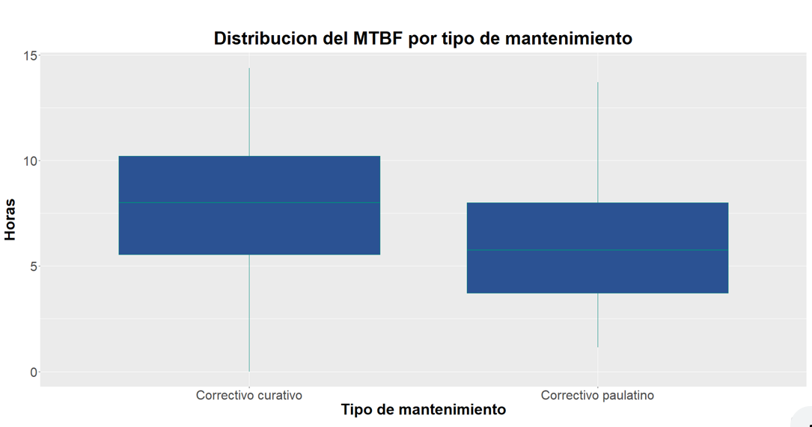

# Desempeño del Mantenimiento en Plastic Omnium Puebla

En este proyecto, utilizamos los datos sobre las fallas que ocurren en el área de pintura de la empresa Plastic Omnium. Esta es una compañía francesa, ubicada en la ciudad de Puebla que se especializa en la manufactura de accesorios plásticos para vehículos. Al departamento de mantenimiento le interesa estudiar las fallas desde un punto de vista estadístico, para así disminuir los gastos ocasionados por los paros de línea

## Proceso

Para evaluar el desempeño del departamento, se utilizan tres indicadores, `MTBF`, `BREAKDOWN` y `MTTR`. El `MTBF` representa el tiempo que hay entre dos paros. El BREAKDOWN nos dice la proporción del tiempo productivo que se utilizó en resolver los paros de línea. Y finalmente El `MTTR` representa el tiempo que duran las fallas

En este estudio, uno de nuestros primeros desafíos fue la limpieza de datos, ya que todo se extrajo de una bitácora en Excel donde el equipo informa las actividades más importantes del día.

## Resultados

Esta gráfica muestra el resumen anual de las diez máquinas con más incidencias. Varios equipos se repiten año tras año, lo que se observa mejor en la siguiente gráfica.

El robot uno de flama, ha sido parte de los equipos que más fallan durante los cinco años consecutivos, seguido por el robot dos de flama y el robot tres de clara. Se recomienda hacer una revisión de los planes de mantenimiento preventivo, para evitar que estas máquinas continúen fallando.

Del mismo modo, se graficaron las máquinas con los paros de línea más largos

El equipo con mayor incidencia anual es el PT Process. Recomendamos realizar un estudio centrado en las fallas que han ocurrido en esta máquina, y así elaborar documentación que ayude a disminuir el tiempo de paro de línea.

En una vista más general de los últimos años, el 2020 no ha tenido un buen desempeño. El 2020 viene a aumentar el `MTTR` en un 10%, el BREAKDOWN en un 25% y a disminuir el `MTBF` en un 5% respecto al año anterior.

Considerando el panorama, la empresa sugirió dos hipótesis que se probaron estadísticamente para explicar el aumento de los indicadores.

* Uno, que el turno de trabajo afecta directamente al `MTTR`.

* Y dos, que el tipo de mantenimiento que se realiza ya sea paulatino o curativo, afecta directamente al `MTBF`.

Para esta prueba ocupamos el test de Wilcox ya que las distribuciones no eran normales.

Respecto a la primera hipótesis, observamos que el primer y el tercer turno tienen un comportamiento muy parecido, cómo se puede apreciar en la gráfica. Por lo cual podemos descartar que el turno afecte el tiempo de reacción de los trabajadores.

Respecto al tipo de mantenimiento que se realiza, los datos del mantenimiento correctivo curativo se encuentran en un rango de `MTBF` mayor que los datos del mantenimiento correctivo paulatino.

Por ello, concluimos que el mantenimiento correctivo afecta de manera positiva al `MTBF`, ya que previene que las fallas se repitan, resultando en un `MTBF` mayor. Por lo mismo, se recomienda promover las buenas prácticas técnicas, para así evitar realizar mantenimientos paulatinos.

Para entender un poco más acerca del comportamiento de las fallas a lo largo de las temporadas del año, decidimos realizar una serie de tiempo, donde nos centraremos en el `BREAKDOWN`.

Observamos que este indicador tuvo una tendencia a la baja entre 2017 y 2018, pero después hubo un aumento a finales de 2019 que se ha mantenido constante hasta la fecha. Podemos notar una periodicidad más marcada que tiende a ser mayor a mediados de año. Esta información es relevante para el departamento ya que nos enfoca a solucionar el problema en temporadas específicas.

Se realizó una predicción del BREAKDOWN, ya que comunica un objetivo tangible que afecta directamente a la producción y se evalúa semanalmente, además cumplir con las características de un modelo estacionario. Se espera que, durante las primeras semanas del 2021, el BREAKDOWN oscile alrededor del 0,05 respecto a la producción, lo cual otorga al equipo de mantenimiento un objetivo claro para intentar cumplir durante este periodo.

## Conclusión

El estudio de estos datos nos ayudó a definir el camino hacia la toma de decisiones informadas, donde podemos establecer objetivos claros y con ellos realizar planes más eficaces en la resolución de la problemática de la empresa. Nosotros, como científicos de datos, tenemos la obligación de llevar a la acción nuestros descubrimientos dentro de todos los números y las líneas de código, tenemos el potencial de dar el primer paso hacia un mundo mejor.